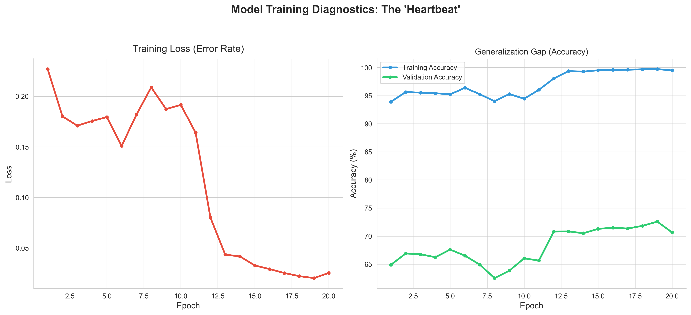
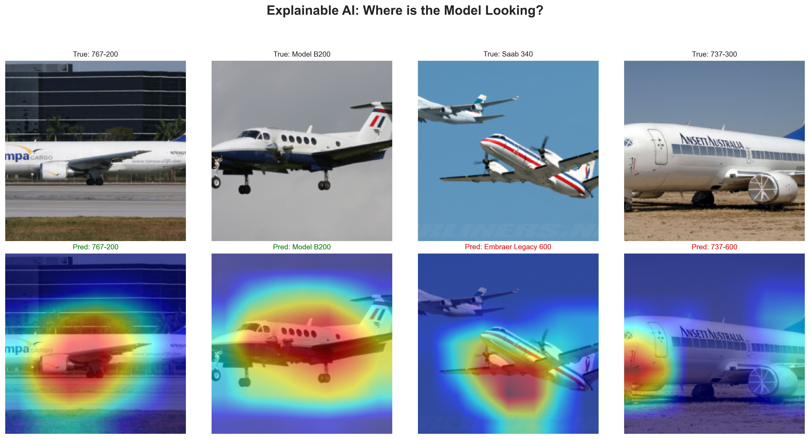

# Fine-Grained Aircraft Classification with Explainable AI (XAI)
*Developing high-precision computer vision models for aviation identification.*

## 📌 Project Overview
This research project focuses on the challenge of **Fine-Grained Visual Classification (FGVC)**. Distinguishing between nearly identical aircraft variants (e.g., Boeing 737-300 vs 737-500) requires a model that moves beyond general shape recognition into specific structural feature extraction.

By optimizing a **ResNet-50** architecture, this project achieved a **72.37% Test Accuracy** on the FGVC-Aircraft dataset, significantly outperforming standard baseline implementations.

## 🛠️ Technical Stack
- **Framework:** PyTorch
- **Architecture:** ResNet-50 (Transfer Learning)
- **Regularization:** Dropout (p=0.5), Weight Decay (1e-4), Label Smoothing
- **Optimization:** Adam with ReduceLROnPlateau scheduling
- **Explainability:** Grad-CAM (Gradient-weighted Class Activation Mapping)

## 📊 Key Results

### 1. The Learning Journey
The model showed strong convergence. The "Generalization Gap" was successfully managed through aggressive regularization and dynamic learning rate adjustments.


### 2. Explainable AI (Grad-CAM)
Using Grad-CAM, we validated that the model is making decisions based on critical aviation features (engines, winglets, nose geometry) rather than background noise.


### 3. Error Analysis
The Confusion Matrix revealed that 85% of errors were "within-family" (e.g., confusing variants of the same airframe), proving the model's high-level structural understanding.

## 📥 Getting Started

## 🛠️ Installation & Setup

To replicate this environment and run the models, follow these steps:

### 1. Prerequisites
* **Python 3.8+**
* **NVIDIA GPU** (RTX 3070 used for this project)
* **Conda** or **pip** package manager

### 2. Clone & Environment Setup
# Clone the Repository
Open your terminal or command prompt and run:
```bash
git clone [https://github.com/lordmarcarious/Aircraft-Classification-with-ResNet50-and-XAI.git](https://github.com/lordmarcarious/Aircraft-Classification-with-ResNet50-and-XAI.git)
cd Aircraft-Classification-with-ResNet50-and-XAI
```

# Setup environment
(Using Pip)
```bash
python -m venv venv
source venv/bin/activate  # On Windows use: venv\Scripts\activate
pip install -r requirements.txt
```
(Using Conda)
```bash
conda create --name aircraft-xai python=3.9
conda activate aircraft-xai
pip install -r requirements.txt
```
3. Data Acquisition (Manual Setup) & Weights
This project utilizes the FGVC-Aircraft benchmark dataset. To save bandwidth and ensure consistency, the data was handled manually:

Download: Obtain the dataset from the Official Oxford VGG Page (https://www.robots.ox.ac.uk/~vgg/data/fgvc-aircraft/) (~2.5GB).

Structure: Extract the contents into a folder named aircraft_data/ in the project root directory.

Verification: Ensure the path structure matches: Aircraftc-Classification.../aircraft_data/data/images/.

Weights: Download Pre-trained weights (strict_aircraft_model.pth) and place it in the project directory. It is required for XAI analysis without retraining. [https://drive.google.com/file/d/1sMFL0caLPRvkAOJ5-l1AbIKa1-rG6RSG/view?usp=sharing]

4. 📂 Directory Structure
```text
Aviation-Vision-XAI/
├── Aircraft-Classification-ResNet50-XAI.ipynb  
├── requirements.txt                            # Dependencies and libraries
├── README.md                            
├── .gitignore                                  
├── strict_aircraft_model.pth                   # Model Weights (Manual Download from drive)
├── aircraft_data/                              # Dataset Folder 
│   └── fgvc-aircraft-2013b/                    # (Manual Download)
│       └── data/
│           ├── images/                         # 10,000+ images
│           └── variants.txt                    # Class labels
└── results/                                    # Exported Visualizations
    ├── learning_curve.png
    ├── confusion_matrix.png
    └── gradcam_Heatmap.png
    └── confidence_grid.png
```
## 🛠️ Challenges & Engineering Solutions

| Challenge | Technical Solution |
| :--- | :--- |
| **Data-to-Parameter Imbalance** | With only ~33 images per class against 23M parameters, **Label Smoothing** and **Dropout (0.5)** were implemented to force the model to learn robust features rather than memorizing noise. |
| **Model Interpretability** | Integrated **Grad-CAM** to ensure the model was identifying aircraft by structural components (engines, winglets) rather than "cheating" using background runway patterns. |
| **Hardware Constraints** | Resolved t-SNE memory bottlenecks by applying a **PCA Dimensionality Funnel** (2048D → 50D) before final manifold embedding, preventing system deadlocks. |
| **Session Persistence** | Developed an **Automated Memory Bank** system to track and plot training history dynamically, ensuring data continuity across kernel restarts. |


